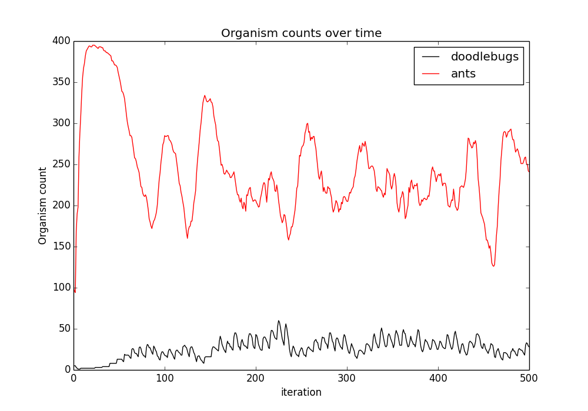

doodlebug
=========

Project inspired by Walter Savitch's 2014 C++ textbook. This program
essentially answers Chapter 16, Question #9 of
_Problem Solving with C++_ (ninth edition).

Overview
--------

The goal for this project is to create a simple two-dimensional
predator-prey simulation. In this simulation the prey are ants
and the predators are doodlebugs. These critters live in a world
composed of a 2D grid of cells. Only one critter may occupy
a cell at a time. The grid is enclosed, so a critter is not
allowed to move off the edges of the world. Time is simulated in
time steps. Each critter performs some action every time step.
You should see a cyclical pattern between the population of
predators and prey, although random perturbations may lead
to the elimination of one or both species.

Usage
-----

Run `make run` to build and run the C++ program, starting the
simulation.

    % make run
    Grid created.
    Creating organisms...
    total # of doodlebugs: 5
    total # of ants: 100
    o - - - o - - - - o - - - - - o o - o -
    - - o o - - - - - - - X - - - - o - - -
    - o o - - - - - - - - - o o o - - o - -
    - o o - o - - - o - - - - - o - - - - o
    o o - - - - - o - - - - o - - - - - - -
    o o - X X - - - - - o - o - - o o - o -
    - - o - - - - o - - o o - - o - - - o -
    o - - - - - - - - - - - - - o - - - - o
    - - - o - - - - - o - - - - - - - - - -
    - - - - - - - - o - - o - - - - - - - -
    - - o - - o - - - o o - - - - o - o o o
    - - - - - o - - - - - - - o - - - o o o
    - - - - - - o - o - - - o - o - - - - -
    o - - - - - - o o - - - o X - - o - - -
    o - o - o - - - - - - - - - - o - - o -
    - - - o - - - - - o o o o o o o - o - o
    - o - - - - - - - - - - o - - - o - - -
    - - - - - - - - - - - - o - - o - - - o
    o o - o - o o - o - - - - o - - X o o -
    - o - - - o - o - - - - - - - - - - - -

    ...

Graph
-----

Run `make graph` to show a graph of the organism counts over a
given number of iterations.

